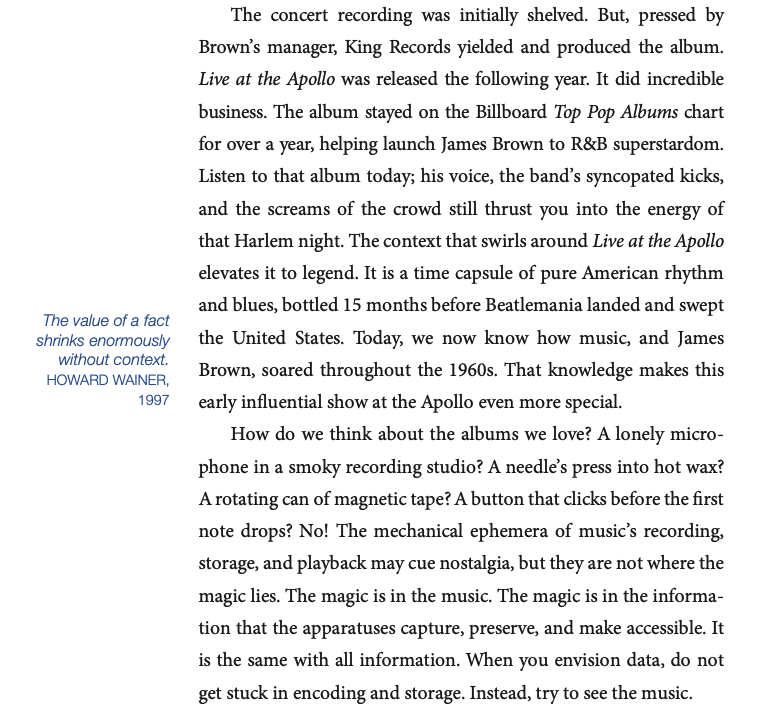
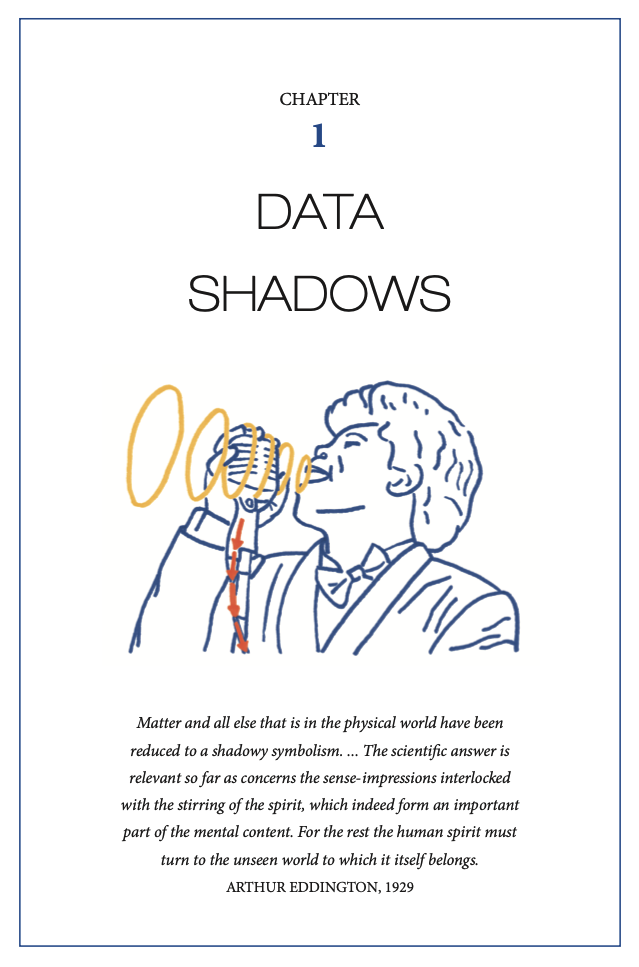
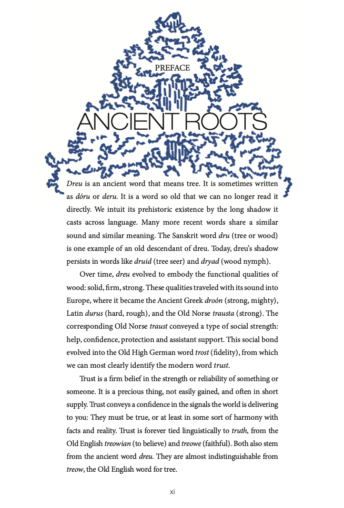
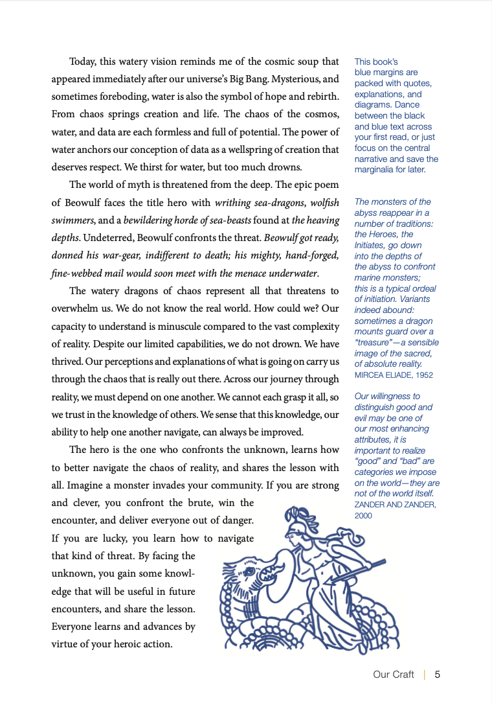

RJ Andrews has put into words the deepest feelings of my soul. [Info we Trust: How to Inspire the World with Data](https://infowetrust.com/project/272) reads and feels like a book for data scientists, much like the Hebrew Bible is for the Jews. I know that comparison could be a bit heretical, but let me explain myself. The book starts at the origin of language (Trust comes from Trees) and moves through the ancient depths of the sea and Beowulf's journeys (the origins of data) to James Brown and the data of music (lived data) to frame the journey.

The first 15 pages articulate a grand view of data and data visualization. RJ's music analogy is beautiful. The fonting and layout of the book are at the [level Tufte's epic works](https://www.goodreads.com/author/show/10775.Edward_R_Tufte). This post shows a few different pages from the book as formatted.

## James Brown and Data

Seeing data as art is the first barrier that needs to be broken down. RJ frames the data problem so well with the following four paragraphs.

He then explains our __Curious World__

> When we create a statistical chart, we intuit that there is something magical about arranging data into forms that can be seen. But this notion is incomplete. It misses that data originates in the physical world. A song recording did not materialize from the ether. The song was once sung by a real person, in a real room. __Likewise, our craft does not just make the invisible, seen. It makes a past reality real again.__   
> &#xA0;       
> Better data stories result when we recognize the material origins of data. Better data stories result when we appreciate how our mind interacts with the physical environment. __When we acknowledge the life that produced data—the real life we see and feel—then we can better comprehend the abstract ecosystems of mathematics, statistics, and data.__

### Live at The Appollo, 1962 (James Brown)

Please listen to the album the next time you need to help someone else feel the _'real life we see and feel'_ in your chart.



## Introduction on Trees and Trust

## Page 5 on Beowulf

